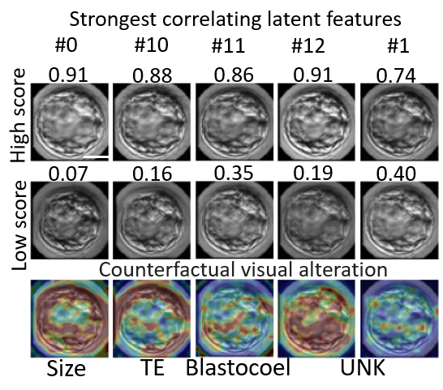
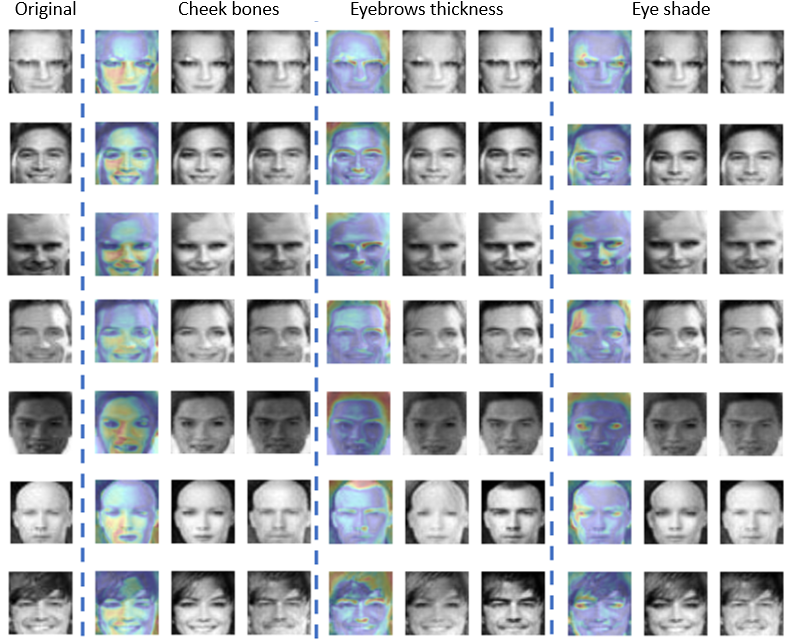

# DISCOVER: Visual interpretability of image-based classification models 
Official Tensorflow2 implementation of: Visual interpretability of image-based classification models by generative latent space disentanglement applied to in vitro fertilization

## Requirements
Python 3.9.10
tensorflow 2.6.2

## IVF analysis

## GENDER faces analysis

## Training celebA or other custom data
* Download celebA data: https://mmlab.ie.cuhk.edu.hk/projects/CelebA.html and save images in 'IMAGES folder' according to current directories
* To train the classifier with celebA data: use 'GENDER_CLF_TRAINING.ipynb'. Update 'data_path' and Run.
* To train DISCOVER with trained classifier: use 'GENDER_DISCOVER_TRAINING.ipynb'. Update 'data_path' and update 'GENDER_CLF_SAVED_MODEL.h5'. 
* To analyze and interpret results: use 'GENDER_ANALYSIS.ipynb'. update 'data_path' and GENDER_CLF_SAVED_MODEL.h5 and  'GENDER_DISCOVER_SAVED_MODELS' folder.  

## Licence

This work is released under the MIT licence.

